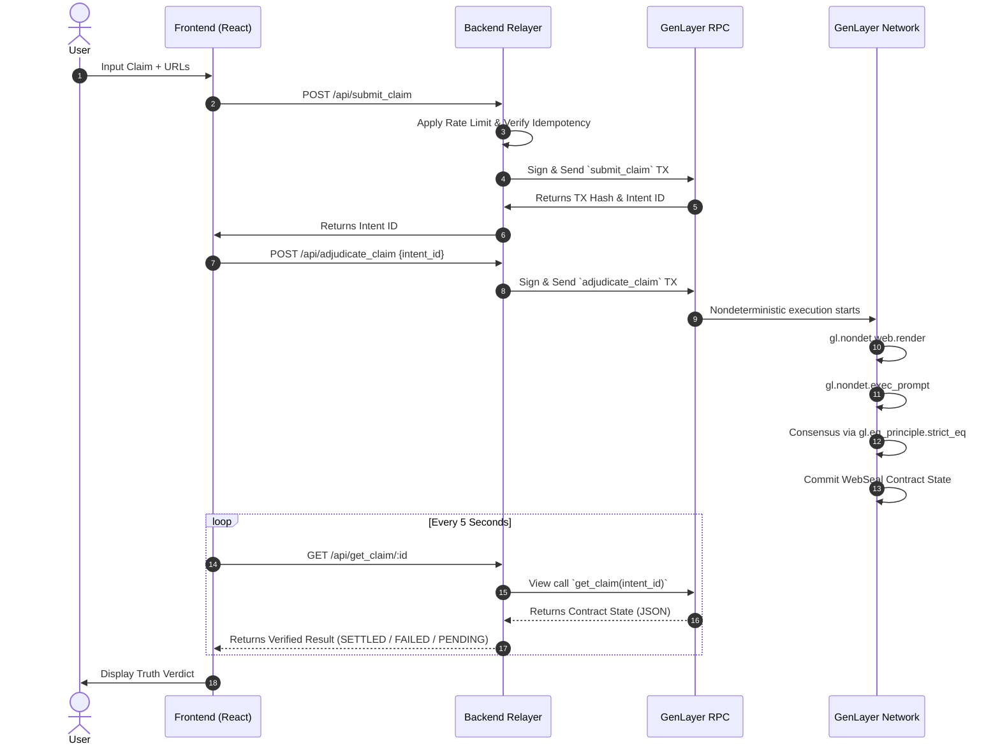

# WebSeal Production Deployment Guide

## 1. Contract Deployment Confirmation

To deploy the `WebSeal` Intelligent Contract to the GenLayer network:

1. Configure the GenLayer CLI or SDK with a funded deployer wallet.
2. Target the production `WebSeal.py` contract file containing: `WebSeal(gl.Contract)`
3. Ensure the deployment allows nondeterministic syscalls (`gl.nondet.web.render`, `gl.nondet.exec_prompt`).
4. Execute deployment:
   ```bash
   genlayer deploy contract/src/WebSeal.py
   ```
5. Capture output:
   - `CONTRACT_ADDRESS`: (Required for Backend)
   - `DEPLOYMENT_TX_HASH`

## 2. Backend Relayer Deployment Configuration

The backend operates as a stateless HTTP relayer and transaction sponsor.

**Hosting Requirement**: Dockerized container on AWS Fargate, Google Cloud Run, or similar stateless runtime.
**Security & State Rules**:
- MUST NOT store claim truth or state locally.
- MUST NOT cache verdicts.
- MUST ONLY forward user inputs via sponsored transactions to the GenLayer RPC.

**Production Requirements Implementations**:
- **Rate Limiting**: Apply at the ingress/API Gateway level to protect the `SPONSOR_PRIVATE_KEY` gas balance.
- **Idempotency**: Use tracking by `Idempotency-Key` headers to prevent duplicating `submit_claim` transactions.
- **Logging**: Console logs MUST exclude `SPONSOR_PRIVATE_KEY` and any PII. Failed GenLayer consensus attempts log the `intent_id` and error name only.

## 3. Frontend Deployment Configuration

The frontend is a static React application containing zero business logic or blockchain SDKs.

**Hosting Options**: Vercel, Netlify, or Cloudflare Pages.
**Build Command**: `npm run build`
**Output Directory**: `dist`

**Rules Enforced**:
- NO private keys in frontend bundles.
- NO direct blockchain JSON-RPC calls.
- NO LLM API calls.
- NO simulated contract responses.

## 4. Environment Variable Mapping

### Backend Environment Constraints
| Variable | Description | Security |
|----------|-------------|----------|
| `GENLAYER_RPC_URL` | Endpoint for the GenLayer network. | Public/Internal |
| `CONTRACT_ADDRESS` | Address of the deployed WebSeal contract. | Public |
| `SPONSOR_PRIVATE_KEY` | Hex private key used to sign gas for users. | **CRITICAL SECRET** (Use Vault/SecretManager) |
| `PORT` | Local port binding. | Internal |

### Frontend Environment Constraints
| Variable | Description | Security |
|----------|-------------|----------|
| `VITE_BACKEND_URL` | Fully qualified URL of the Backend Relayer. | Public |

## 5. End-to-End Request Flow Diagram



## 6. Health Check Endpoints

**Backend Layer**
- `GET /api/health`
  - Returns `200 OK`
  - Body ensures `"status": "healthy"` and `"genlayer_rpc_status": "connected"`.
  - Determines container liveness safely without leaking secrets or executing TXs.

**Contract Layer**
- Execution state is monitored by backend; unreachable network defaults to safely throwing errors upwards to UI framework to render as `PENDING` or `FAILED`.
