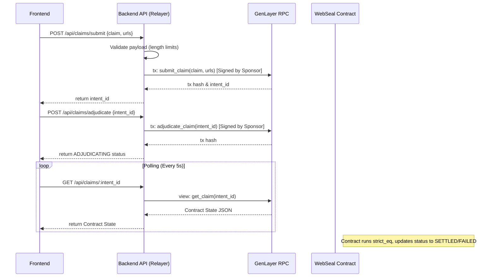

# WebSeal Backend Relayer Specification

## 1. Backend Architecture Design
WebSeal's backend is a strict **Passive Sponsored Relayer**. It acts as a bridge between the stateless Web2 frontend and the stateful Web3 GenLayer Intelligent Contract. 
- **Roles**: Expose HTTP endpoints, sign transactions with a funded Sponsor Wallet, push transactions to the GenLayer RPC, and poll for state changes.
- **Strict Constraint**: The backend is a passive transaction relayer only. It contains ZERO intelligence, LLM calls, logic parsing, or consensus simulation. All truth evaluation strictly executes inside the GenLayer Intelligent Contract environment. The backend MUST preserve the integrity of `submit_claim`, `adjudicate_claim`, and `get_claim`, and MUST NOT introduce any off-chain intelligence logic beyond relaying.

## 2. API Contract Specification

**POST /api/claims/submit**
- **Purpose**: Submits a new claim and evidence URLs to the GenLayer contract.
- **Request Body**:
```json
{
  "claim": "SpaceX caught the Super Heavy booster on flight 5.",
  "urls": ["https://bbc.com/news/123", "https://reuters.com/article/456"]
}
```
- **Response**:
```json
{
  "intent_id": 42,
  "transaction_hash": "0xabc123...",
  "status": "SUBMITTED"
}
```

**POST /api/claims/adjudicate**
- **Purpose**: Triggers the `adjudicate_claim` execution for a specific intent ID. 
- **Request Body**:
```json
{
  "intent_id": 42
}
```
- **Response**:
```json
{
  "intent_id": 42,
  "transaction_hash": "0xdef456...",
  "status": "ADJUDICATING"
}
```

**GET /api/claims/:intent_id**
- **Purpose**: Long-polls or standard GET to fetch the latest state of an intent from the GenLayer contract via `get_claim`.
- **Response**:
```json
{
  "intent_id": 42,
  "status": "SETTLED",
  "claim": "SpaceX caught the Super Heavy booster on flight 5.",
  "evidence_urls": ["https://bbc.com/news/123"],
  "result": {
    "verdict": "TRUE",
    "confidence": 99,
    "reason": "News reports confirm the successful catch of the booster."
  },
  "submitted_at": 1700000000,
  "settled_at": 1700000045
}
```

## 3. Transaction Flow Diagram (Mermaid)



## 4. Idempotency Strategy
- **Client Request ID Tracking**: The frontend sends a unique `Idempotency-Key` header with each POST request.
- **Cache Layer (Redis/Memory)**: The backend checks if a transaction for this exact `Idempotency-Key` was already submitted successfully.
- **Contract Resilience**: If a duplicate `adjudicate_claim` is submitted before settlement, the contract's internal state check (`if self.status[intent_id] != "SUBMITTED": raise INVALID_STATE`) guarantees safety and rejects it. The backend gracefully catches `INVALID_STATE` and instructs the frontend to simply fall back to polling.

## 5. Polling Strategy
- The backend API provides a RESTful `/api/claims/:intent_id` endpoint.
- The backend relies natively on `gl.public.view` (`get_claim`) calls to the GenLayer RPC instead of attempting to parse transaction event logs.
- The backend polling ONLY reads the GenLayer contract state. It does NOT interpret the meaning of the results, nor does it transform the verdict logic in any way.
- The frontend will poll this endpoint on a fixed interval (e.g., every 5 seconds). 
- If the endpoint receives a query, it immediately calls the GenLayer RPC to ensure fresh on-chain data is returned to the user without caching staleness.

## 6. Folder Structure

```text
backend/
├── package.json
├── tsconfig.json
├── .env                  # Contains SPONSOR_PRIVATE_KEY
└── src/
    ├── server.ts         # Express setup & middleware
    ├── routes/
    │   └── claims.ts     # Route definitions 
    ├── controllers/
    │   └── claimController.ts # Request validation & responses
    ├── services/
    │   └── genlayerService.ts # SDK Integration, Sponsor Tx Signing
    └── utils/
        └── errorHandler.ts    # Maps contract errors to HTTP codes
```

## 7. Deployment Architecture
- **Stateless Containers**: The backend runs as stateless Docker containers.
- **No Database**: The backend does NOT maintain a relational database for truth or state. GenLayer is the sole source of truth.
- **Sponsor Key Secret**: The `SPONSOR_PRIVATE_KEY` is injected securely at runtime via a Secret Manager.

## 8. Security Boundaries
- **Wallet Abstraction**: The user never connects a Web3 wallet. The backend acts as a stateless relayer regarding truth evaluation, and its sponsor wallet absorbs all transaction gas costs.
- **Zero Intelligence**: The backend is strictly prohibited from modifying, censoring, or evaluating the claim or result. It purely serializes inputs for RPC submission and deserializes JSON state. It is NOT a decision system, and is NOT a data processor of truth.
- **DDoS / Spam Protection**: Because the backend spends real GenLayer computational gas, it strictly enforces per-IP Rate Limiting and payload size limits to mitigate financial exhaustion attacks on the Sponsor Wallet. Idempotency prevents duplicate transactions.

## 9. Hard Security Policy: Secret Management & Git Safety
- The `SPONSOR_PRIVATE_KEY` MUST NEVER be committed to GitHub or any version control system.
- No private keys, API keys, or secrets of any kind may appear in:
  - Source code
  - Commits
  - Pull requests
  - Logs
  - Frontend bundles
  - Documentation examples containing real secrets
- The backend MUST ONLY reference the `SPONSOR_PRIVATE_KEY` securely via environment variables (`.env`), secure runtime secret managers, or external vault systems.
- The backend MUST NEVER expose or transmit the `SPONSOR_PRIVATE_KEY` to the frontend, and MUST NEVER log the key.
