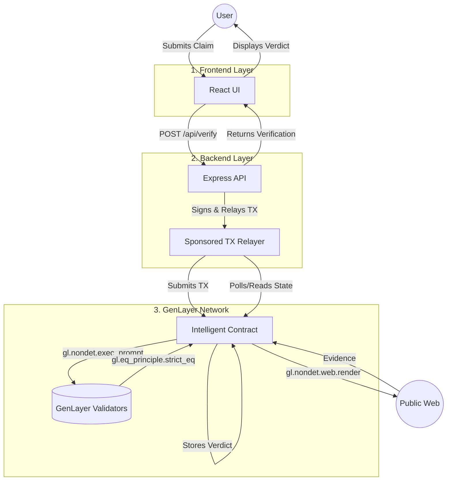

# WebSeal Architecture Specification

**Tagline**: "Decentralized verification for real-world claims using GenLayer Intelligent Contracts."

## 1. Full Modular Architecture Diagram



## 2. Exact Monorepo Folder Structure

```text
webseal/
├── package.json               # Root dependencies & workspace config
├── frontend/                  # React SPA (Vite + Tailwind)
│   ├── src/
│   │   ├── components/        # UI components (Minimal & clean)
│   │   ├── pages/             # Page views
│   │   ├── api/               # API client for backend communication
│   │   └── App.tsx            # Main application entry point
│   └── package.json
├── backend/                   # Express/Node API
│   ├── src/
│   │   ├── routes.ts          # API route definitions
│   │   ├── controller.ts      # Validates request & handles response
│   │   ├── relayer.ts         # GenLayer SDK Tx signing & sponsoring
│   │   └── server.ts          # Express server entry
│   └── package.json
└── contract/                  # GenLayer Intelligent Contracts
    ├── src/
    │   └── WebSeal.js         # The actual Intelligent Contract logic
    ├── scripts/               # Deployment scripts
    └── package.json
```

## 3. Frontend ↔ Backend API Contract

The communication strictly relies on standard HTTP REST endpoints.

**Endpoint:** `POST /api/claims`
- **Purpose**: Submits a new claim to be verified.
- **Request Body Payload (JSON)**:
  ```json
  {
    "claim": "Did SpaceX successfully test starship yesterday?"
  }
  ```
- **Response Shape (JSON)**:
  ```json
  {
    "transactionHash": "0xabc123...",
    "status": "pending_verification"
  }
  ```

**Endpoint:** `GET /api/claims/:transactionHash`
- **Purpose**: Polling endpoint for the frontend to get the final verification result.
- **Response Shape (JSON)**:
  ```json
  {
    "status": "verified",
    "verdict": "true",
    "rationale": "Following NYT and BBC reports, SpaceX landed the booster...",
    "confidence": "high",
    "evidenceUrl": "https://bbc.com/news/123"
  }
  ```

## 4. Backend ↔ GenLayer Transaction Flow

The backend operates as a Sponsored Transaction Relayer and is entirely agnostic to the intelligence protocol.
1. **Receive:** Backend receives a plaintext claim from the Frontend API.
2. **Build Tx:** Constructs a transaction calling `verifyClaim(claimText)` on the pre-deployed `WebSeal.js` GenLayer contract.
3. **Sign & Pay Gas:** Backend signs the transaction with a funded private key (the "Sponsor"), removing the need for user wallets.
4. **Broadcast:** Pushes the signed transaction to the GenLayer RPC.
5. **Poll/Hook:** Backend polls the GenLayer RPC for the transaction receipt and resulting state changes.

## 5. GenLayer Deployment-Aware Architecture

The system is decoupled into two operational lifecycles:
1. **Deployment Lifecycle (Offline):** 
   - Operations deploy the `WebSeal.js` intelligent contract to the GenLayer testnet/mainnet.
   - The resulting `CONTRACT_ADDRESS` is supplied to the Backend environment variables.
2. **Execution Lifecycle (Online):**
   - The Backend utilizes the GenLayer JS/TS SDK to build transactions pointed at `CONTRACT_ADDRESS`.
   - The IC executes entirely within the decentralized GenLayer Validator environment, reaching intelligent consensus natively.

## 6. File-by-File Responsibility Breakdown

### `frontend/src/App.tsx`
- **Role**: Collect string input from the user (the claim) and present an elegant loading and result state.
- **Constraint**: Must never import Web3 SDKs or evaluate claims locally.

### `backend/src/controller.ts`
- **Role**: Rate limiting, payload validation (confirming the claim is a string and conforms to length constraints), orchestrating the relayer.

### `backend/src/relayer.ts`
- **Role**: Manage the Sponsor Wallet private key. Encode ABI and transmit the execution transaction to GenLayer RPC. Retrieve transaction receipt and subsequent view calls.

### `contract/src/WebSeal.js`
- **Role**: The core trust engine. 
  - Exposes `verifyClaim(claim)` as a `gl.public.write` function.
  - Exposes `getClaim(id)` as a `gl.public.view` function.
  - Implements the Web request using `gl.nondet.web.render`.
  - Analyzes the scraped web data using `gl.nondet.exec_prompt`.
  - Asserts objective reality across validators using `gl.eq_principle.strict_eq`.
- **Constraint**: Must strictly conform to non-deterministic execution standards natively provided by GenLayer.

## 7. Communication Flow Between All Layers

1. **User → Frontend**: Types a claim into a text input, clicks "Verify".
2. **Frontend → Backend**: Sends HTTPS POST request to `/api/claims` with the data.
3. **Backend → GenLayer RPC**: Formats payload into a smart contract transaction, signs with sponsor key, pushes via SDK.
4. **GenLayer RPC → GenLayer Validators**: Dispatches transaction for consensus execution.
5. **GenLayer IC → Public Internet**: Contract pauses determinism, uses `gl.nondet.web.render` to fetch search results/news data.
6. **GenLayer IC → LLM Protocol**: Contract runs `gl.nondet.exec_prompt` to adjudicate the claim against gathered data.
7. **GenLayer Validators → IC State**: Validators reach consensus using `strict_eq` and write final verdict into world state.
8. **GenLayer RPC → Backend**: Backend fetches the updated state from the chain.
9. **Backend → Frontend**: Backend returns the structured JSON verdict.
10. **Frontend → User**: Renders the final Verification result.

## 8. Recommended Technologies for Each Layer

- **Frontend**: React 18, Vite, Tailwind CSS, Lucide React (Icons).
- **Backend**: Node.js, Express, TypeScript, Ethers.js / GenLayer SDK.
- **Contract**: Vanilla JavaScript (`WebSeal.js`) running in GenLayer's V8 Sandbox.

## 9. Backend Sponsored Transaction Design

- **Goal**: Abstract away Web3 complexity (zero user wallets, zero user gas).
- **Mechanism**: The backend holds a hot wallet private key initialized via Environment Variables (`SPONSOR_PRIVATE_KEY`).
- **Security**: The backend implements strict rate limiting per IP to prevent spamming the GenLayer network and draining the sponsor wallet. 
- **Idempotency**: The backend checks if the exact same claim hash has already been verified on-chain to avoid duplicating intelligence gas costs.

## 10. Clean Separation of Concerns

- The **Frontend** does not know *how* verification happens, nor does it know a blockchain is involved. It just displays structured JSON from the API.
- The **Backend** does not perform *any* verification or AI prompting. It merely bridges Web2 HTTP with Web3 transactions and sponsors the gas.
- The **GenLayer Contract** does not care *who* sent the transaction. It is the sole custodian of intelligence, using native GenLayer non-deterministic calls to resolve truth and reach cryptographic consensus.

## 11. Deployment-Ready Architecture Optimized for GenLayer

- **Idempotent Intelligence**: To optimize GenLayer execution costs, the contract stores a mapping of `claimHash -> result`. If a user queries an already verified claim, the contract returns the cached truth instantly via a cheap `gl.public.view` call.
- **Deterministic Prompting**: Because GenLayer relies on validator consensus, LLM prompts inside `WebSeal.js` must be carefully constructed to yield highly deterministic outputs (e.g., forcing JSON outputs, using low temperature, enforcing a `"true" | "false" | "inconclusive"` taxonomy) ensuring that the `strict_eq` equivalence principle safely resolves consensus across disparate validator nodes.
